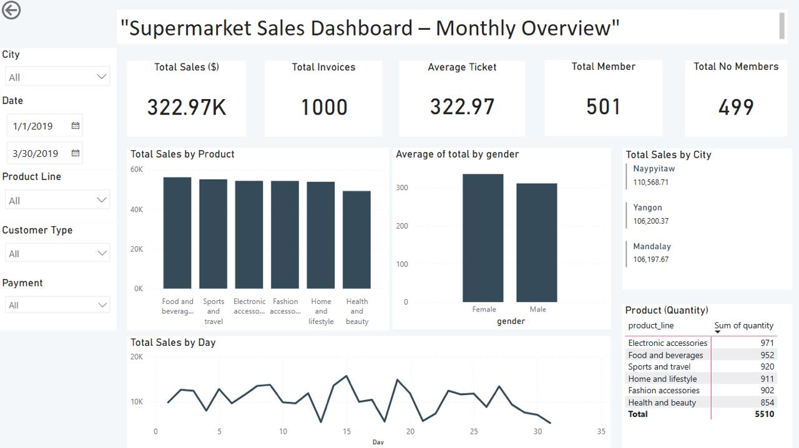
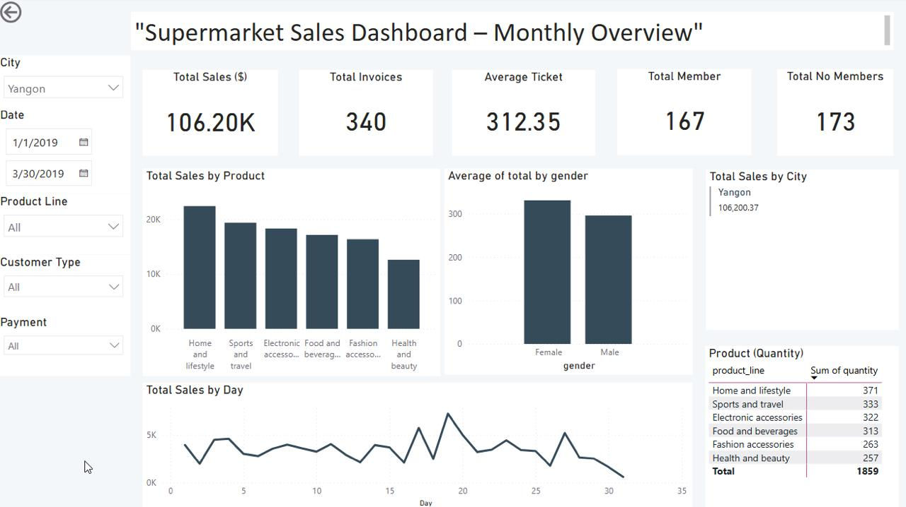
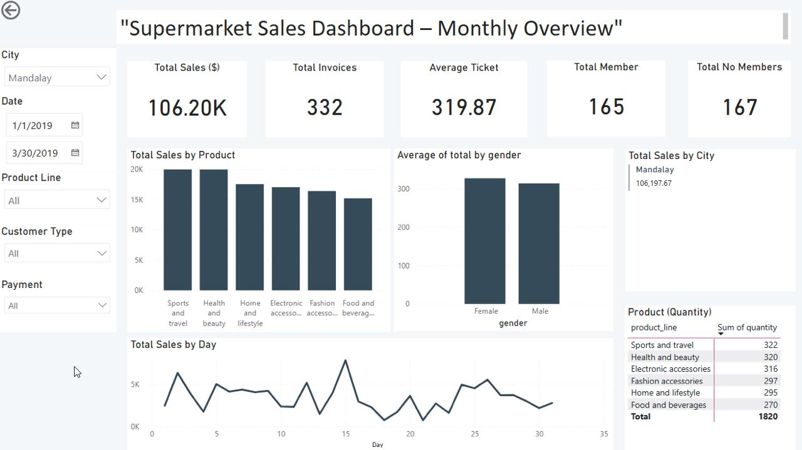
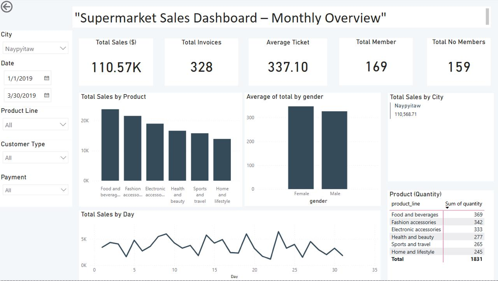

# 🛒 Supermarket Sales – ETL and Data Validation Project

## 📌 Project Overview

This project demonstrates a complete ETL (Extract, Transform, Load) pipeline using a real-world dataset of supermarket transactions. The goal is to extract sales data from a CSV file, transform and clean it using Python, and load it into a PostgreSQL database. We then validate the inserted data and prepare it for visualization in Power BI or other BI tools.

---
## 🚀 Highlights

- End-to-end ETL pipeline in Python
- Data validation with SQLAlchemy
- Clean export to CSV
- Interactive dashboard built with Power BI
- Version control and modular project structure

--- 

### 🔍 Insights:

- Sales are relatively evenly distributed among the three cities: Yangon (33.8%), Mandalay (33.1%), and Naypyitaw (33.1%), with no dominant location.
- Women generate a 5.3% higher average ticket than men (Female: \$322.99 vs. Male: \$306.63).
- The most sold product line by quantity is **Electronic Accessories**, accounting for 19.2% of all units sold.
- 61% of all sales occur between the 10th and 20th of each month, indicating a mid-month purchase pattern.

---

## 🧰 Tech Stack

- **Python 3.11**
- **PostgreSQL** (local instance)
- **pandas** – data manipulation
- **SQLAlchemy** – database connection
- **dotenv** – environment variable management
- **Power BI** – for dashboards (planned in next stage)
- **Git + GitHub** – version control

---

## 📁 Project Structure


```bash
data-portfolio/
├── data/02_supermarket_sales/ # Original and cleaned CSVs
├── scripts/02_supermarket/ # ETL and cleaning scripts
├── notebooks/02_supermarket_sales/ # Analysis notebooks (ETL, validation)
├── figures/02_supermarket/ # Power BI visuals and .pbix file
```

Other folders in root project:

/data/02_supermarket_sales/ # Contains the original CSV file
/scripts/02_supermarket/ # Custom Python cleaning functions (e.g., cleaning.py)
/figures/02_supermarket/ # Visual outputs from data analysis and Power BI

🖼 Sample dashboard preview:




---

## 📄 Dataset Description

The dataset used is [`supermarket_sales.csv`](https://www.kaggle.com/datasets/aungpyaeap/supermarket-sales), which contains:

- Invoice details
- Branch and city
- Customer type and gender
- Product line and quantity
- Pricing, VAT, payment method
- Date and time of transaction

📦 Rows: 1,000  
📊 Columns: 17

🧼 After ETL, the cleaned version is exported to:

`/data/02_supermarket_sales/cleaned_data/supermarket_cleaned.csv`

---

## 📊 Power BI Dashboard

The Power BI report built for this project includes insights such as:

- Total sales by city
- Revenue per product line
- Average transaction by gender
- Sales by payment method and day

🔗 The `.pbix` file is available in [`/figures/02_supermarket/powerbi_supermarket.pbix`](../figures/02_supermarket/powerbi_supermarket.pbix)

## 📸 Power BI Visual Gallery

These screenshots provide a quick glance at the insights uncovered:

- **Sales Overview Dashboard**
  
- **Total Sales – Yangon**
  
- **Total Sales – Mandalay**
  
- **Total Sales – Naypyitaw**
  

## ⚙️ How to Run

1. Clone the repo and set up a Python virtual environment (optional):

```bash
git clone https://github.com/jmfe2/data-portfolio.git
cd data-portfolio
```
   
2. Install libraries

```bash
pip install -r requirements.txt
```

3. Create a .env file in the root directory with the following keys 

*Make sure your `.env` file is not tracked by Git. A `.env.example` is suggested for collaborators.*

```bash
DB_USER=your_username
DB_PASS=your_password
DB_HOST=localhost
DB_PORT=5432
DB_NAME=your_database
```

4. Run notebooks in order:

- `02_supermarket_postgresql.ipynb` – Loads CSV into PostgreSQL
- `03_validate_and_git.ipynb` – Runs validation queries and tracks changes with Git

---

#### 4. Optional enhancements

- Mention log file location:

```md
ETL logs are written to: `/logs/etl_supermarket.log`
 
